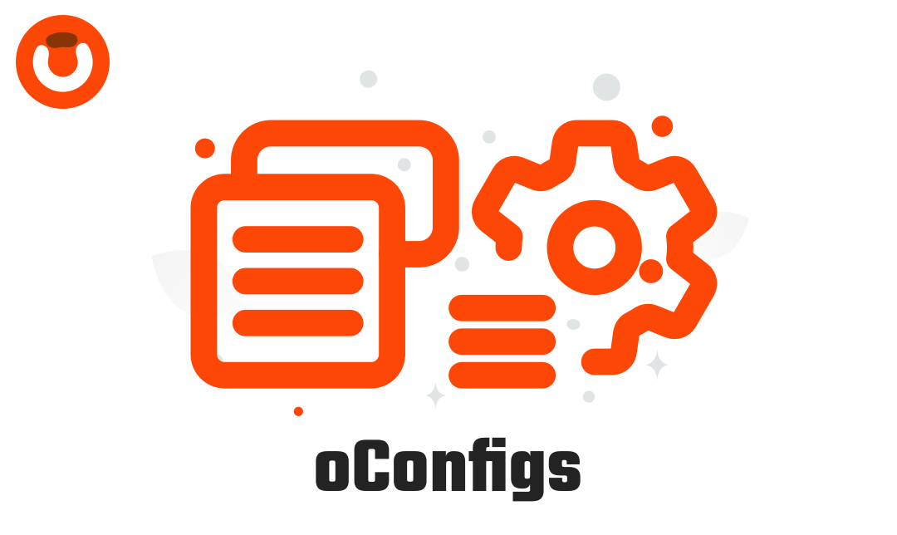

  
  

# oConfigs Package

You can add and manage options within the configurations and overwrite the application configurations without having to change the values inside the configuration files.

## Documentation

You can find the detailed documentation here in [Documentation](https://obelaw.com/docs/1.x/packages/o-configs.html).

## Contributing

Thank you for considering contributing to this package! Be one of the Store team.

## License

This package is an open-sourced software licensed under the [MIT license](https://opensource.org/licenses/MIT).
